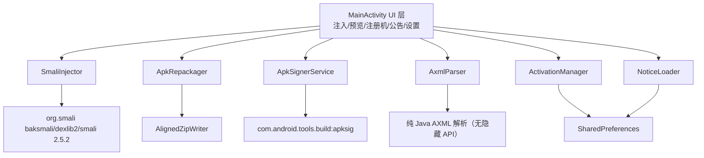

# Injector 全量修复技术设计

Feature Name: injector-full-fixes
Updated: 2026-10-09
需求文档: `requirements.md`（同目录）

## Description

重构 `com.example.injector`（MainActivity.java，1474 行单类）为分层结构，闭合注入链路（反编译 → 插桩 → 汇编 → 对齐重打包 → v1/v2 重签名），替换隐藏 API 的 Manifest 解析，修复崩溃、安全与依赖问题。

构建环境约束：CodeAssist（`module.toml` + `deps/libraries.json`），Java 8 语言级，minSdk 24 / targetSdk 34。本工程无 Gradle/JUnit 基建，验证方式为设备侧自验 + 产物外部校验（`apksigner verify`、安装、运行）。

## Architecture

调用链：选宿主 APK 与弹窗包 → `AxmlParser` 解析启动类 → baksmali 反编译 → smali 插桩 → `Smali.assemble` 汇编 → `AlignedZipWriter` 重写 APK（保压缩属性 + 对齐 + 剔除旧签名）→ `ApkSignerService` v1/v2 签名 → 输出 `injected.apk`。

## Components and Interfaces

全部新组件为无 Android UI 依赖的纯 Java 类（便于未来补 JUnit），放置于 `com.example.injector.core` 包。

### 1. AxmlParser（新增，替换问题 6 的 XmlBlock 反射）

- 输入 `byte[]`（二进制 AndroidManifest），输出 `ManifestInfo { packageName, List<String> launcherTargets }`。
- 实现：解析 chunk 头 → string pool → resource map → START/END TAG 事件流；属性按 `android:name` / `android:targetActivity` 的资源 ID 匹配（`0x01010003` name、`0x01010202` targetActivity、`0x01010002` package），按 INTENT 类型值解析字符串属性。
- 状态机处理 `activity` / `activity-alias`（问题 4）：alias 取 `targetActivity`；`MAIN`+`LAUNCHER` 在同一 intent-filter 内同时命中才计入；相对类名（`.` 前缀）拼接 `package`（问题 5）。

### 2. SmaliInjector（自 MainActivity 抽取 + 修复问题 1、9、10）

- `baksmali` 反编译（`jobs` 上限 4，问题 18）。
- 插桩逻辑（替换现 `insertInvokeInOnCreate`）：
  - 定位 `onCreate(Landroid/os/Bundle;)V`。
  - 解析 `.locals N`（或 `.registers M` 反算），将局部寄存器数 +1，用于 `move-exception`。
  - 在 `invoke-super` 后插入：`:try_start_x` → xymods 首条 `invoke-` 行 → `:try_end_x` → `.catch Throwable {:try_start_x .. :try_end_x} :catch_x` → `:catch_x` → `move-exception v(new)`。标签号按方法内已有标签计数保证唯一。
  - 未找到 `invoke-super` 或 `xymods.txt` 无 `invoke-` 行 → 抛出带明确原因的异常。
- 汇编：新增依赖 `org.smali:smali:2.5.2`，调用 `Smali.assemble(SmaliOptions, smaliDir)`（实现时以 libraries.json 内 jar 的实际 API 签名为准核对；2.5.2 中存在 `Smali.assemble` 目录级入口与 `Smali.assembleSmaliFile` 单文件入口，优先目录级），产物写 `patched.dex`。
- 汇编失败时保留 smali_tmp 目录路径写进错误日志（问题 1 的核心闭环 + R1.2）。

### 3. AlignedZipWriter（新增，问题 3、18 的核心）

自写流式 zip writer（`ZipOutputStream` 无法控制 data offset 对齐），约 250 行：

- 逐 entry 处理：LOCAL FILE HEADER 手工构造，`general purpose bit 3` + data descriptor（免提前知晓 CRC/size）。
- 对齐规则：在 extra field 中填充 padding，使所有 STORED entry 数据起始偏移按 4 字节对齐；`*.so`（STORED）按 4096 对齐；`resources.arsc` 强制 STORED + 4 字节对齐。
- 压缩方式继承原 entry（问题 3）；新增 entry（弹窗 dex、assets）默认 DEFLATED。
- 读取侧用 `ZipFile`（读 central directory 获取原 entry method/size），读取流式拷贝，峰值内存与文件大小解耦（问题 18）。
- 输出前跳过 `META-INF/` 下 `*.SF`、`*.RSA`、`*.DSA`、`*.MF`（问题 2 的前置清理）。

### 4. ApkSignerService（新增，问题 2）

- 依赖：`com.android.tools.build:apksig:8.5.0`（纯 Java，设备端可用）。
- 签名流程：`DefaultApkSignerEngine`（minSdk 24，v1+v2 开启，v3 关闭）→ `ApkSigner.Builder(...).build().sign()`。
- 密钥管理（R2.5/R2.6）：
  - 自动密钥：`AndroidKeyStore` 生成 RSA-2048（`KeyGenParameterSpec`，用途 `SIGNATURE`），别名 `injector_autogen`；证书链取自 KeyStore。AndroidKeyStore 私钥经 JCA `Signature` 接口供 apksig 使用，无需导出。
  - 导入密钥：设置页选 `.p12/.jks/.bks` 文件，依次尝试 PKCS12 → JKS → BKS 类型加载，列出别名，校验通过后记录（别名 + 密码存 SharedPreferences，文件拷入私有目录）。
  - 导入失败（密码错/无对应别名的私钥）→ 提示具体原因，保持自动密钥生效（R2.6）。
- 失败清理：删除半成品输出文件（R2.7）。

### 5. ZipSafety（新增，问题 11）

- `unzipSafe(InputStream, File dir)`：每个 entry 名做 `new File(dir, name).getCanonicalPath()` 前缀校验；越界即抛异常并中止。`unzip()`、弹窗包解压统一走该入口。

### 6. ActivationManager（抽取，问题 12）

- 密钥存 SharedPreferences（`secret_key`），注册机页新增"密钥"编辑项；HMAC 逻辑保持（`yyyyMMddHHmm` + `|aurora`，±10 分钟窗）。
- 移除静默失败：`hmac()` 异常上抛，由调用方展示错误。

### 7. NoticeLoader（抽取，问题 15）

- 公告 URL 存 SharedPreferences（`notice_url`），设置页可编辑；请求失败展示离线文案并标注"离线公告"。

### 8. MainActivity（瘦身）

- 仅保留页面搭建、文件选择（SAF）、线程调度与日志展示。
- 预览页修复：删除 `:687` 重复 `addView`（问题 17 崩溃）；入口方法调用改由 `Handler(Looper.getMainLooper())` 投递到主线程，后台线程以带 30 秒超时的 latch 等待结果（问题 8）。
- 注入页对话框：`askUserWhichActivity` 增加超时（`latch.await(30, SECONDS)`），超时取第一项并记日志（问题 7）。

### 9. Manifest 与依赖变更

- `AndroidManifest.xml`（问题 13、14）：`allowBackup="false"`；删除 `READ_/WRITE_EXTERNAL_STORAGE`；删除 `largeHeap`。
- `module.toml`（问题 16）：`material` 统一 `1.14.0`；新增 `org.smali:smali:2.5.2`、`com.android.tools.build:apksig:8.5.0`；`baksmali`/`dexlib2` 保持 `2.5.2`。
- `deps/libraries.json`（问题 16）：删除 `apktool-lib` 及 `smali 3.0.3` 相关条目（smali 3.0.3 需 Java 11+，与本工程 Java 8 冲突），仅保留 `org.smali 2.5.2` 全家桶与 AndroidX/material 条目，并新增 apksig 条目（格式照抄现有条目结构）。
- 文案（问题 19）：UI 中 Aurora 命名统一为 Injector。

## Data Models

- `ManifestInfo { String packageName; List<String> launcherTargets; }`
- `Prefs 新增键: notice_url(String)、secret_key(String，首启写入默认值)、ks_alias(String)、ks_pass(String)、ks_file(String)`
- 日志条目沿用现有 `LogConsole`。

## Correctness Properties

1. 产物中每个保留 entry 的压缩方式与原 APK 一致。
2. 产物中 `resources.arsc` 为 STORED 且数据偏移按 4 字节对齐。
3. 产物不含旧签名条目，且 `apksigner verify` 通过（v1+v2）。
4. `patched.dex` 回读（baksmali）后包含插入的 invoke 指令与 `.catch Throwable` 块。
5. 任意解压落盘路径均位于目标目录内。
6. 注入调用抛出的任意异常被捕获，宿主 `onCreate` 继续执行。

## Error Handling

| 场景 | 处理 |
|------|------|
| smali 汇编失败 | 中止注入，日志含 smali 文件路径与汇编器报错原文 |
| xymods.txt 无有效 invoke 行 | 中止注入，提示弹窗包配置缺失 |
| Manifest 解析失败 | 中止注入，日志含 AXML 解析位置 |
| 宿主 dex 版本超出 dexlib2 2.5.2 支持范围 | 中止并提示宿主编译目标过新 |
| 重打包 IO 失败 | 删除半成品，日志报错 |
| keystore 导入失败 | 提示原因，回退自动密钥 |
| 签名失败 | 删除半成品，日志报错 |
| 公告请求失败 | 展示离线文案 |
| 弹窗预览异常 | 日志页展示异常，应用存活 |

## Test Strategy

本工程在 CodeAssist 上构建，无 JUnit 基建，采用三层验证：

1. **设备侧功能验证**（用户执行）：预览页开页不崩；预览弹窗在主线程弹出；注入产出 `injected.apk`。
2. **产物外部校验**（用户执行）：PC 上 `apksigner verify -v injected.apk` 应显示 v1+v2 均通过；Android 11+ 设备安装并启动，弹窗出现；在弹窗入口人为抛异常的场景下宿主功能正常。
3. **设计保障**：`AxmlParser`、`AlignedZipWriter`、`SmaliInjector` 插桩与 `ZipSafety` 均为纯 Java 静态逻辑（仅 `Context` 以参数形式传入或完全隔离），为后续引入 JUnit 留下直接可测的边界。

## Risks

| 风险 | 缓解 | 实施结果 |
|------|------|----------|
| CodeAssist 无法解析 `com.android.tools.build:apksig`（Google Maven） | 备选方案：v1 签名用纯 Java JAR 签名实现，v2 用自写 APK Signing Block 写入器（格式公开，约 400 行） | 已化解：apksig-8.5.0.jar 已离线放置到 `project/.platform/caches/resolved-deps/`，libraries.json 指向该缓存路径 |
| AndroidKeyStore 私钥与 apksig 兼容性问题 | 备选方案：引入 `org.bouncycastle:bcprov-jdk15on:1.70` 生成自签证书，密钥落盘 PKCS#12 | 保留备案；apksig 通过 `java.security.Signature` 使用 KeyStore 私钥，理论上兼容，待设备验证 |
| smali 2.5.2 `Smali.assemble` 实际签名与预期不符 | 实现时先解包 libraries.json 中 smali jar 核对 API，必要时用 `assembleSmaliFile(File, DexBuilder, ...)` 逐文件汇编 | 已化解：沙盒内用 Python 解析 jar 常量池核对，`Smali.assemble(SmaliOptions, String... dirs) → boolean`、SmaliOptions 公开字段 apiLevel/outputDexFile/jobs/verboseErrors 均存在，SmaliInjector 按此实现 |
| 宿主 APK 使用 v3+/轮换签名或加密壳 | 超出本次范围，注入失败时输出明确日志 | 维持范围外；旧签名条目已在重打包时剔除，v1+v2 由 apksig 重出 |

## 交付说明（实施回写）

- 签名采用 apksig 高层 API `ApkSigner.Builder`（计划中的 `DefaultApkSignerEngine` 为其底层引擎，高层 API 内部封装同一流程，含 minSdk 24 与 v1/v2 开关）。
- `ZipSafety` 对外方法名为 `unzip(InputStream, File)`（即计划中的 unzipSafe，语义一致：canonical path 越界即抛 IOException）。
- 产物自检 `ApkRepackager.verifyProperties` 输出：P1 压缩方式一致性、P2 resources.arsc STORED+4 对齐（localDataOffset 解析 LFH 实际数据偏移）、旧签名剔除情况；`SmaliInjector.verifyPatchedDex` 输出 P4 回读自检。
- AlignedZipWriter 曾在沙盒原型验证中发现 offset 未计数据字节的 bug，已修复（writeStored/writeDeflated 均累加数据长度）。
- 沙盒无 JDK，API 核对方式：Python 解析 class 常量池（apksig-8.5.0.jar、smali-2.5.2.jar）+ Python 复刻 zip 字节布局对照 `zipfile`（对齐/CRC/压缩位标志全通过，见会话记录）。

## References

[^1]: (Filename#L498) - `injectCallIntoDex` 空转问题，`project/app/src/main/java/com/example/injector/MainActivity.java`
[^2]: (Filename#L569) - `rebuildApk` 无签名无对齐，同上
[^3]: (Filename#L1083) - `unzip` Zip Slip，同上
[^4]: (Filename#L687) - 预览页重复 addView，同上
[^5]: (module.toml) - 依赖声明，`project/app/module.toml`
